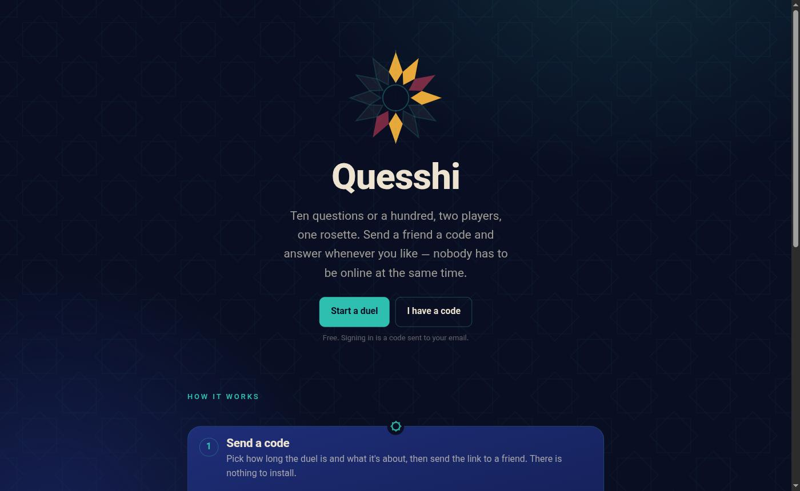
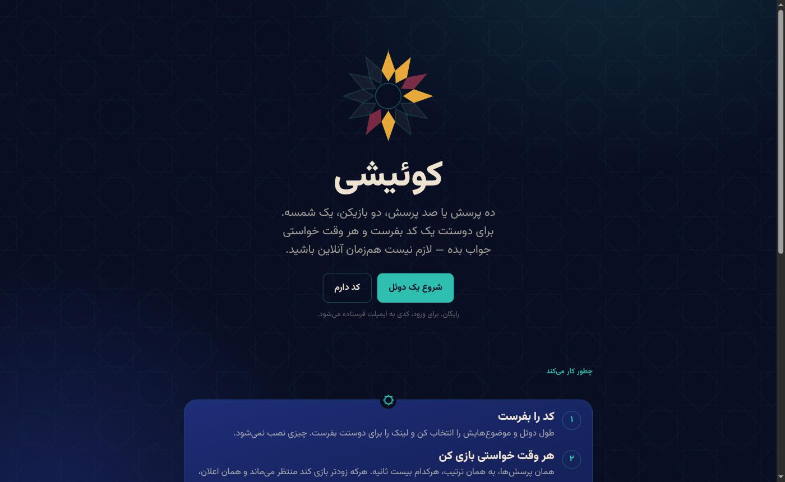
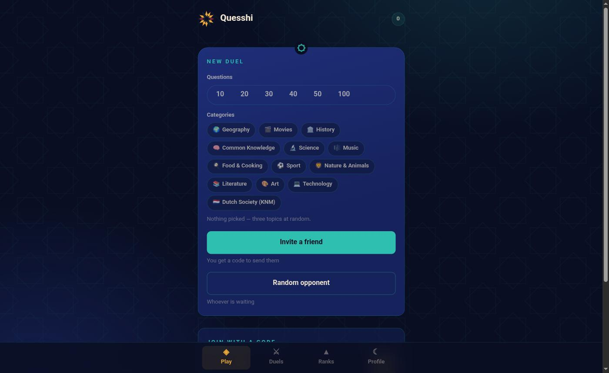
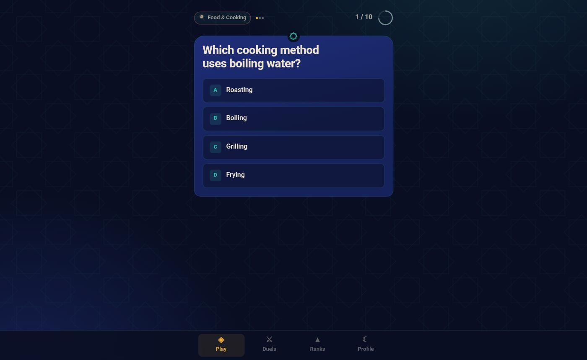

# Quesshi · کوئیشی

**Asynchronous trivia duels for friends who are never online at the same time.**

Two players get the same questions in the same order. Whoever plays first waits, and the
notification is the game. Trilingual from the ground up — Persian, English and Dutch, each with its
own question bank rather than a machine translation of someone else's.

<p align="center">
  
  
</p>

---

## How a duel works

- **Ten to a hundred questions.** Three categories in rotation, or pick your own.
- **Four choices, exactly one correct.** Twenty seconds each, timed by the server.
- **`100 × correct + up to 60 speed bonus`**, the bonus decaying linearly to zero at the buzzer.
- **Difficulty ramps** across the run — five levels spread evenly from the first slot to the last,
  so a ten-question duel climbs two levels at a time and a hundred-question one climbs in twenties.
- **You cannot see the other player's answers**, or their score, until your own run is finished.
- **A duel nobody answers for 48 hours is forfeited.**

The scoreboard is a *shamseh*, the twelve-ray Persian rosette: half the rays are yours and half are
theirs, one per question, saffron for right and pomegranate for wrong. The star only completes when
both of you have played, which is exactly what a duel is. Past twenty questions it becomes two
rings, because a ray thinner than the line around it is not a scoreboard.

<p align="center">
  
  
</p>

## Run it

```bash
podman compose up -d          # or: docker compose up -d   — Mongo + Redis
dotnet run --project src/Quesshi.Server
```

Then open <http://localhost:5010>. One process serves everything: the API, the Blazor bundle and the
Orleans silo.

With no SMTP host configured the app is in **dev sign-in mode** — the one-time code is printed to the
log *and* shown on the sign-in screen, so you can sign in as any address without a mail server. The
app refuses to start in Production in that state unless you explicitly accept it, because it means
anyone can sign in as anyone.

```bash
dotnet test                   # 212 tests; only the grain tests need anything running, and they self-host
```

To play against yourself, sign in as two addresses in two browser profiles, start a duel in one and
join with the code in the other.

### The admin panel

`/admin`, with **its own username-and-password sign-in**, entirely separate from the game. A player
account carries no privilege there.

On the first start against an empty database the app creates one administrator and prints the
credentials. That password is temporary — you land on the change-password screen and cannot go
anywhere else until you replace it. Locked out of every account?

```bash
dotnet run --project src/Quesshi.Server -- add-admin someone someone@example.com "a long passphrase"
```

## How it is built

```
src/
  Quesshi.Domain/              entities and rules; references nothing
  Quesshi.Application/         use cases and the ports they need
  Quesshi.Infrastructure/      Mongo, Redis, the OpenRouter generator, OTP senders
  Quesshi.Grains.Abstractions/ grain interfaces and their serializable contracts
  Quesshi.Grains/              grain implementations
  Quesshi.Server/              ASP.NET host (the Orleans silo runs inside it), endpoints, seed data
  Quesshi.Web/                 Blazor WebAssembly PWA (game and admin)
  Quesshi.Shared/              the DTOs that cross the wire
tests/
  Quesshi.Domain.Tests/        scoring and the match state machine
  Quesshi.Application.Tests/   use cases against in-memory fakes
  Quesshi.Server.Tests/        grains, on a real Orleans test cluster
```

Dependencies point inward: Domain ← Application ← Infrastructure/Grains/Server. One type per file,
throughout.

**There is no separate Orleans host.** The silo is co-hosted in the ASP.NET app
(`builder.UseOrleans(…)`), so it scales with the API rather than beside it. Anything that only
*calls* a grain references `Quesshi.Grains.Abstractions` and never sees an implementation.

**Redis** carries Orleans clustering, live match state, reminders and the leaderboard.
**Mongo** carries everything durable: players, questions, categories, match history.

A live duel is a grain; a finished one is a document. The grain is the single writer while the match
is being played, which is what makes "twenty seconds, server-timed" true rather than hopeful.

## Two identities, on purpose

Playing and administering are different accounts with different credentials:

|                | Game                                 | Admin panel                        |
| -------------- | ------------------------------------ | ---------------------------------- |
| Sign-in        | Passwordless — email code, or Google | Username and password              |
| Token audience | `quesshi`                            | `quesshi-admin`                    |
| Signing key    | `Jwt:Key`                            | `AdminAuth:Key`                    |
| Session        | 30 days                              | 8 hours                            |
| Reset          | Request a new code                   | Emailed link, single use, one hour |

The two tokens are signed with different keys and validated by different authentication schemes, so a
player token presented to an admin endpoint fails *validation* rather than merely failing an
authorisation check. Admin sign-in is rate limited: ten failures locks the account for fifteen
minutes, an unknown username costs exactly as much time as a wrong password, and neither sign-in nor
forgot-password ever reveals whether an account exists.

Password rules are length-first — ten characters minimum, no composition requirements, a small
blocklist of obvious choices. Hashing is ASP.NET Identity's PBKDF2, not hand-rolled.

## The question bank

2,244 hand-written questions ship with the app — 1,000 Persian, 1,042 English and 202 Dutch — across
thirteen categories, seeded on first start and re-seeded idempotently after that. The Dutch bank is
**KNM**, for the Dutch civic-integration exam; the other twelve are Persian and English.

Beyond that, **Admin → Generate now** asks a model through OpenRouter to top up any
`(language, category, level)` bucket that has fallen below target. A category is only topped up in
languages it already has questions in, so adding a language does not silently commission a whole new
bank in it. The same run can happen nightly if `Generation:Nightly` is on; it ships off.

### Not writing the same question twice

Three layers, cheapest first:

1. **A unique index on `(language, topic)`.** The generator names each question's *subject* and
   *aspect* — `inception|director` — and the store refuses a second one. "Wie regisseerde Inception?"
   and "Inception werd geregisseerd door wie?" share no words at all and collide correctly. The same
   topic may exist once per language, because the same fact is a fair question in each.
2. **Wording comparison** for everything with no topic, including the whole seed bank.
   `PromptFingerprint` normalises case, punctuation, Persian spelling variants (`ي`/`ی`, `ك`/`ک`, the
   zero-width non-joiner, Arabic-Indic digits), drops question scaffolding words, and compares the
   content words that remain by containment rather than by Jaccard — a short question wholly inside a
   longer one is still the same question.
3. **The batch checks against itself**, not just against the stored bank.

The ceiling is marked in the source: layer 2 matches wording, not meaning, and the upgrade is
sentence embeddings. Layer 1 is what catches paraphrase today.

## Translations

No user-facing string lives in the code. Browser texts are flat key/value JSON in
`src/Quesshi.Web/wwwroot/i18n/{fa,en,nl}.json`, fetched at start-up and swapped in place when the
language changes — no reload, no satellite assemblies. Server-side texts are the same shape in
`src/Quesshi.Server/i18n/`. A missing key renders as the key, so gaps are visible rather than silent.

`.resx` would have been the framework answer; flat JSON was chosen because these files are edited by
translators rather than by an IDE, and because swapping culture at runtime in WebAssembly otherwise
means a page reload.

Persian is right-to-left throughout and numerals render in the Persian set — including the CSS
counters on the landing page, via `counter(step, persian)`.

## Media questions

A question may carry one image, audio clip or short video. Three ship in the seed as a worked example
— a flag to identify, a musical interval to name, a clip to count bounces in — and the admin panel
uploads more.

The seed media is generated, not downloaded: the flag and the video frames are written by a
hand-rolled PNG encoder, the interval is synthesised with Python's `wave` module, and gstreamer muxes
the frames into WebM. Nothing here depends on a stock-media licence.

## Configuration

Everything is optional; the app runs with none of it.

| Setting                       | What it does                                                                             |
| ----------------------------- | ---------------------------------------------------------------------------------------- |
| `Smtp:Host`                   | Mails the sign-in code instead of showing it. **Set this before going live.**             |
| `Jwt:Key`                     | Signing key for player tokens. Random per start otherwise, so restarts sign everyone out. |
| `AdminAuth:Key`               | Signing key for admin tokens. **Separate from `Jwt:Key` on purpose.**                     |
| `AdminAuth:SessionHours`      | How long an admin session lasts. Default 8.                                               |
| `AdminAuth:BootstrapPassword` | First admin's password. Random and printed to the log when empty.                         |
| `Auth:GoogleClientId`         | Shows the Google sign-in button. Hidden when empty.                                       |
| `OpenRouter:ApiKey`           | Turns on question generation. Without it the generator reports itself unconfigured.       |
| `OpenRouter:Model`            | Any model id OpenRouter serves, e.g. `google/gemini-2.5-flash`.                            |
| `Generation:Nightly`          | Runs the top-up every night. Off by default; the admin button works regardless.           |
| `Generation:AutoApprove`      | Publish generated questions immediately instead of parking them for review.               |

Put local values in `appsettings.Development.json` or user secrets. **Do not commit keys** —
`appsettings.Development.json` and `appsettings.Local.json` are gitignored for exactly that reason.

## Built with

.NET 10 · ASP.NET Core · Blazor WebAssembly (PWA) · Microsoft Orleans · MongoDB · Redis · xUnit

No CSS framework and no component library: the interface is about 700 lines of hand-written CSS on a
Persian tile palette — lapis ground, turquoise and saffron glaze — with Vazirmatn carrying both
scripts, so Persian and English have the same personality rather than two different designs.
